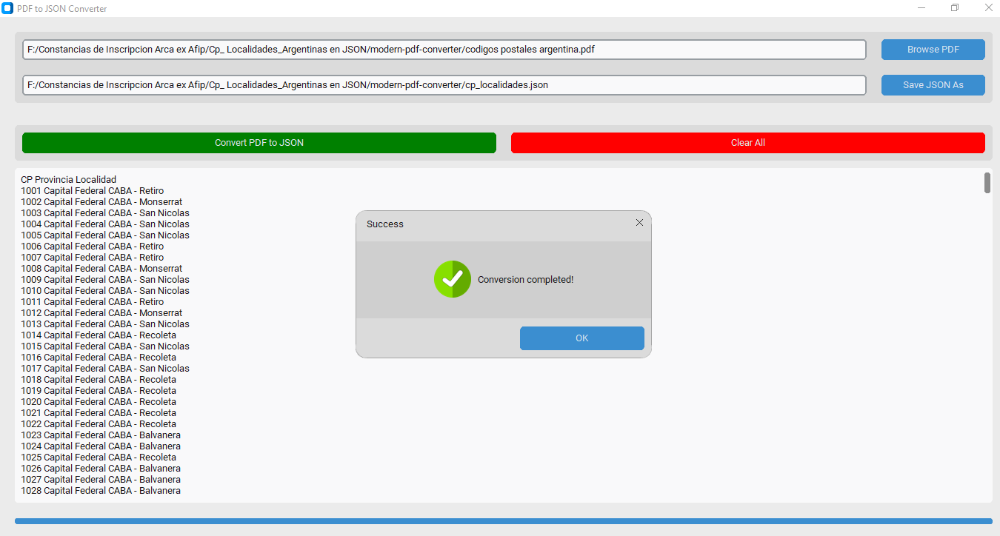

# Codigo_Postales_Localiades_Argentinas

Este proyecto es un conversor de PDF a JSON diseñado para convertir un archivo PDF específico que contiene códigos postales de la República Argentina y sus localidades en un archivo JSON. La idea principal es facilitar el trabajo con esta información en formato JSON, permitiendo una manipulación y procesamiento más eficientes en aplicaciones que requieran datos geográficos estructurados.

## Descripción

El conversor permite seleccionar un archivo PDF de entrada (`codigos postales argentina.pdf`) y especificar una ubicación para el archivo JSON de salida resultante. Esto es útil para procesar y manejar datos de códigos postales más fácilmente en aplicaciones que requieran información geográfica estructurada.



## Instrucciones

1. Clona el repositorio:
   ```bash
   git clone [url del repositorio]
   ```


3. Instala las dependencias:
   ```bash
   pip install -r requirements.txt
   ```

## Uso

1. Ejecuta la aplicación:
   ```bash
   python modern-pdf-converter.py
   ```

2. Selecciona el archivo PDF de entrada (`codigos postales argentina.pdf`).
3. Elige la ubicación para el archivo JSON de salida.
4. Haz clic en el botón "Convertir".

## Requisitos

- customtkinter==5.2.2
- pypdf==3.17.1
- CTkMessagebox==2.5

## Licencia

MIT

## Contribuyendo

1. Fork del repositorio.
2. Crea una rama de características.
3. Envía una solicitud de extracción.